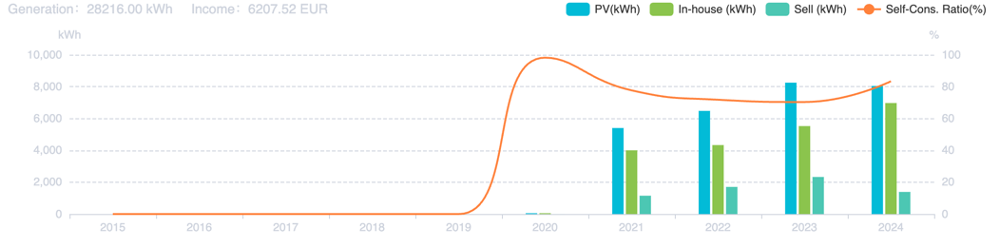
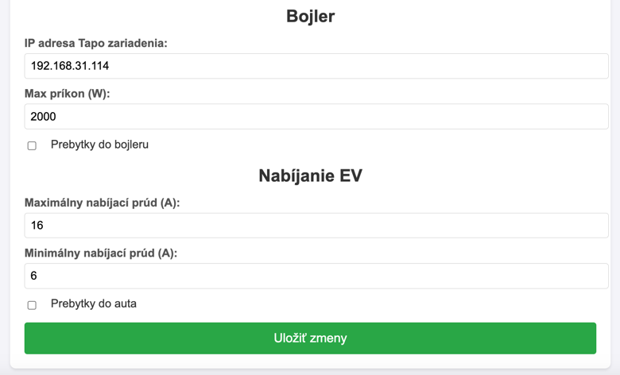

# FVE Under Control
Tento nástroj slúži na optimalizáciu využitia elektrickej energie z FV systémov pomocou jednoduchých nástrojov
a lacných a rýchlych riešení. Používaním preberáte zodpovednosť za všetky možné aj nemožné škody.

## Motivácia
Mnoho ľudí, ktorí si nainštalovali fotovoltaické (FV) systémy, nevyužíva naplno energiu, ktorú generujú, 
často kvôli nedostatku vhodných nástrojov a infraštruktúry na efektívne riadenie a skladovanie tejto energie. 
Zatiaľ čo solárne panely dokážu počas dňa, najmä v slnečných oblastiach, vyrábať elektrinu, mnoho domácností nemá 
batériové systémy na uchovanie energie na nočné hodiny alebo obdobia, keď je zamračené. Okrem toho absencia 
inteligentných systémov na správu energie znamená, že nie sú schopní optimalizovať využitie solárnej energie, 
čo vedie k plytvaniu energiou alebo k závislosti na elektrickej sieti počas špičky. Bez dostupných nástrojov na 
sledovanie, ukladanie a efektívnu distribúciu tejto energie zostáva plný potenciál domácej solárnej energie 
nevyužitý, čo znižuje úspory nákladov aj environmentálne prínosy.

Spotové ceny elektriny zároveň s veľkou batériou (to pre každého môže znamenať niečo iné) prípadne s veľkým odberom
(nabíjanie EV) umožňujú ďalšiu úroveň optimalizácie.

Tento nástroj sa zameriava na tri hlavné možnosti optimalizácie:
1. Posielanie prebytkov energie do bojleru pomocou inteligentnej zásuvky Tapo P1XX.
2. Posielanie prebytkov energie do elektrického (prípadne plug-in) hybridného vozidla pomocou wallboxu ABL eMH1.
3. Nabíjanie batérie podľa úrovne spotových cien.

Značná časť majiteľov fotovoltaiky nedokáže v letných mesiacov využiť ani len polovicu vyrobenej energie, tú vo 
väčšine prípadov posiela do siete - zadarmo. Viem dokonca o prípadoch, kedy priemerne viac než 70% vyrobenej energie
v mesiaci putovalo do siete.

Toto je graf využitia energie za celé vlastníctvo mojej FVE. Ako vidno na obrázku, v roku 2023 na strechu pribudli
ďalšie panely a zároveň sa rozšírila kapacita batérie. Target na rok 2025 je 90%. 



## Inštalácia

### Hardware
Bohužiaľ, bez nákupu HW sa to nezaobíde. Pre ovládanie používam Raspberry Pi Zero W, na ktorom je možné bez problémov
pustiť celú aplikáciu.

#### Menič
Testované len na meniči GoodWe GW10K-ET. Pravdepodobne bude fungovať aj na iných od GoodWe. V aplikácii je potrebné
zistiť IP adresu meniča, všetka komunikácia beží po lokálnej sieti.

#### Bojler
Pre ovládanie bojleru (pokiaľ máte klasický na zásuvku 220V) som použil
[Tapo P110](https://www.tp-link.com/cz/home-networking/smart-plug/tapo-p110/). Oproti P100 má výhodu v meraní spotreby.
Stačí klasicky pridať do Tapo aplikácie a v nastaveniach si zistiť IP adresu. V tomto prípade nebežíme po lokálnej
sieti, ale musíme cez cloud. V [tapo_utils.py](link missing) je preto potrebné natvrdo špecifikovať meno a heslo.
Cena cca 300 kč.

#### Wallbox
Využil som Wallbox ABL eMH1, keďže ako jeden z mála ho je možné ovládať externe a meniť nabíjací prúd. Je možné
rovnako použiť wallbox od Tesly, ale len Gen 2. Dokumentácia je podľa mňa nedostatočná, ako je potrebné zapojiť
patch cord do RS-485 som našiel len v nejakom nemeckom komentári na Githube. Je teda potrebné si zakúpiť adaptér
USB A na RS-485, ten pôjde logicky do Raspberry.
Cena momentálne dosť vysoká, ja som za môj dal cca 3500 kč bez DPH.

### Software
Projekt je napísaný v Django (python). Aj keď sa už pravdepodobne jedná o prehistorický nástroj, je to jediné,
s čím mám ako takú skúsenosť.

Inštalácia requirements:
```bash
pip install -r requirements.txt
```

Django DB a spustenie servera:
```bash
python manage.py migrate
python manage.py runserver
```

Hlavný nástroj má podobu webovej stránky, kde je možné nastaviť potrebné parametre (IP adresy, ...). Každú zmenu je 
potrebné potvrdiť tlačítkom dole. Pri zmene parametrov a bežiacej subrutine sa automaticky subrutina zastaví 
a reštartuje s novými parametrami.



Zároveň je potrebné sledovať log v konzoli. V prípade, že subrutina v pythone spadne alebo prestane fungovať, web 
o tom nijak neinformuje.


#### evcc
Pre ovládanie wallboxu používam https://github.com/evcc-io/evcc.
Pre inštaláciu je vhodné použiť dokumentáciu. Následne sa vytvorí `evcc.yaml` súbor, v ktorom je potrebné nastaviť
časť `chargers` zhruba takto:
```
chargers:
- type: template
  template: abl
  id: 1
  device: /dev/ttyACM0
  baudrate: 38400
  comset: 8E1
  modbus: rs485serial
  name: wallbox1
```
Komplet config nájdete [tu](missing link).

## Použitie
Ako je popísané vyššie, systém obsahuje tri hlavné subrutiny. Táto kapitola obsahuje moje osobné
doporučenie, ako ich používať.

### Posielanie prebytkov energie do bojleru
Osobne používam len v letnom období. Systém detekuje, že úroveň nabitia batérie je vysoká a pretoky energie čoskoro 
poputujú do siete - dôjde k zapnutiu inteligentnej zásuvky. Samozrejme, či reálne bojler bude nahrievať alebo nie
záleží od teploty vody a iných parameterov, ktoré zásuvka nie je schopná ovplyvniť.
Pozor na fakt, že k splneniu tejto podmienky nemusí počas dňa dôjsť, a ak si večer neželáte nasranú ženu (ako ja), 
ktorá sa sťažuje, že tečie len zimná voda, doporučujem nastaviť časy, v ktorých bude nahrievať vždy.

### Posielanie prebytkov energie do EV
Tiež používam len v letnom období, funguje obdobne ako ovládanie bojleru. Na wallboxe ABL je možné konfigurovať
nabíjací prúd od 6A do 16A, preto volíme taký, aby to pokrylo prebytky.

### Nabíjanie batérie podľa úrovne spotových cien
Používam len v zimnom období - v lete tak trochu počítam s tým, že sa batéria nabije zo slnka a nemusím ju preto 
nabíjať zo siete. Podľa cien OTE a pár pravidiel (lokálne extrémy etc.) prepína módy batérie. Momentálne je
implementované len nabíjanie batérie zo siete, nie predaj. Osobne razím cestu čo najvyššieho využitia vlastných 
zdrojov.


## TODO
1. Pridať zimný mód, kedy šanca prebytkov je malá a všetko sa riadi podľa spotových cien.
2. Pridať fixnú dobu, kedy bude bojler zapnutý - pokiaľ beží subrutina bojleru, je možné, že aj keď sú v aplikácii 
nastavené časy zapnutia, subrutina bojler proste vypne.
3. Integrácia úrovne batérie nabitia EV. Wallbox ABL to nedokáže detekovať, preto je potreba ísť cez cloud daného 
výrobcu vozidla. Môže sa totižto stať, že EV sa nabíjať nebude vôbec. evcc na to poskytuje nejakú podporu, ale
pre môj Enyaq mi to nefungovalo.
4. AI model - prediktor pre výrobu FVE a spotrebu domácnosti. 
5. AI model - kedy nabíjať, vybíjať, držať stav batérie, prípadne kedy predávať do siete.

## Disclaimer
Tento kód aj README boli z veľkej časti vytvorené s pomocou chatGPT 4o. Nejedná sa o produkt, ale o víkendový
hackathon. Ak nemáte skúsenosti s programovaním, s ohľadom na kvalitu kódu a tohto samotného návodu máte asi problém.